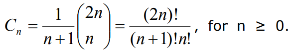
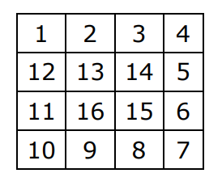

# Exercises #
This contains only code exercises from the book.  

1. Write a program that prints on the console the numbers from 1 to N. 
The number N should be read from the standard input.
2. Write a program that prints on the console the numbers from 1 to N, 
which are not divisible by 3 and 7 simultaneously. The number N 
should be read from the standard input.
3. Write a program that reads from the console a series of integers and 
prints the smallest and largest of them.
4. Write a program that prints all possible cards from a standard deck
of cards, without jokers (there are 52 cards: 4 suits of 13 cards).
5. Write a program that reads from the console number N and print the sum 
of the first N members of the Fibonacci sequence: 0, 1, 1, 2, 3, 5, 8, 
13, 21, 34, 55, 89, 144, 233, 377, …
6. Write a program that calculates N!/K! for given N and K (1 < K < N).
7. Write a program that calculates N!*K!/(N-K)! for given N and K 
(1 < K < N).
8. In combinatorics, the Catalan numbers are calculated by the following formula:    
Write a program that calculates the nth Catalan number by given n.
9. Write a program that for a given integers n and x, calculates the sum:    
10. Write a program that reads from the console a positive integer number 
N (N < 20) and prints a matrix of numbers as on the figures below:    
11. Write a program that calculates with how many zeroes the factorial of 
a given number ends. Examples:
N = 10 -> N! = 3628800 -> 2
N = 20 -> N! = 2432902008176640000 -> 4
12. Write a program that converts a given number from decimal to binary 
notation (numeral system).
13. Write a program that converts a given number from binary to decimal 
notation.
14. Write a program that converts a given number from decimal to 
hexadecimal notation.
15. Write a program that converts a given number from hexadecimal to 
decimal notation.
16. Write a program that by a given integer N prints the numbers from 1 to N 
in random order.
17. Write a program that given two numbers finds their greatest common 
divisor (GCD) and their least common multiple (LCM). You may use 
the formula LCM(a, b) = |a*b| / GCD(a, b)
18. Write a program that for a given number n, outputs a matrix in the 
form of a spiral. Example for n = 4:  

