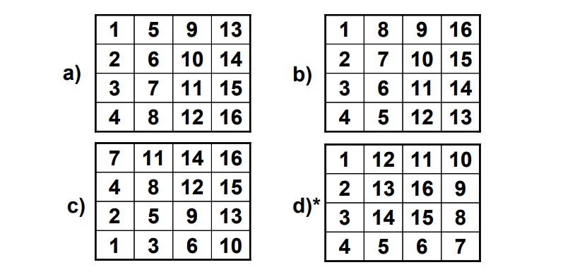
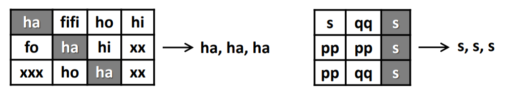

# Exercises #
This contains only code exercises from the book.

1. Write a program, which creates an array of 20 elements of type 
integer and initializes each of the elements with a value equals to the 
index of the element multiplied by 5. Print the elements to the console.
2. Write a program, which reads two arrays from the console and checks 
whether they are equal (two arrays are equal when they are of equal 
length and all of their elements, which have the same index, are equal).
3. Write a program, which compares two arrays of type char
lexicographically (character by character) and checks, which one is first 
in the lexicographical order.
4. Write a program, which finds the maximal sequence of consecutive 
equal elements in an array. E.g.: {1, 1, 2, 3, 2, 2, 2, 1}  {2, 2, 2}.
5. Write a program, which finds the maximal sequence of consecutively 
placed increasing integers. Example: {3, 2, 3, 4, 2, 2, 4}  {2, 3, 4}.
6. Write a program, which finds the maximal sequence of increasing 
elements in an array arr[n]. It is not necessary the elements to be 
consecutively placed. E.g.: {9, 6, 2, 7, 4, 7, 6, 5, 8, 4}  {2, 4, 6, 8}.
7. Write a program, which reads from the console two integer numbers N
and K (K < N) and array of N integers. Find those K consecutive 
elements in the array, which have maximal sum.
8. Sorting an array means to arrange its elements in an increasing (or 
decreasing) order. Write a program, which sorts an array using the 
algorithm "selection sort".
9. Write a program, which finds a subsequence of numbers with 
maximal sum. E.g.: {2, 3, -6, -1, 2, -1, 6, 4, -8, 8}  11
10. Write a program, which finds the most frequently occurring element in 
an array. Example: {4, 1, 1, 4, 2, 3, 4, 4, 1, 2, 4, 9, 3}  4 (5 times).
11. Write a program to find a sequence of neighbor numbers in an array, 
which has a sum of certain number S. Example: {4, 3, 1, 4, 2, 5, 8},
S=11  {4, 2, 5}.
12. Write a program, which creates square matrices like those in the 
figures below and prints them formatted to the console. The size of the 
matrices will be read from the console. See the examples for matrices 
with size of 4 x 4 and make the other sizes in a similar fashion:    
13. Write a program, which creates a rectangular array with size of n by m 
elements. The dimensions and the elements should be read from the 
console. Find a platform with size of (3, 3) with a maximal sum.
14. Write a program, which finds the longest sequence of equal string
elements in a matrix. A sequence in a matrix we define as a set of 
neighbor elements on the same row, column or diagonal.    
15. Write a program, which creates an array containing all Latin letters. 
The user inputs a word from the console and as result the program 
prints to the console the indices of the letters from the word.
16. Write a program, which uses a binary search in a sorted array of 
integer numbers to find a certain element.
17. Write a program, which sorts an array of integer elements using a "merge
sort" algorithm.
18. Write a program, which sorts an array of integer elements using a "quick
sort" algorithm.
19. Write a program, which finds all prime numbers in the range 
[1...10,000,000].
20. * Write a program, which checks whether there is a subset of given 
array of N elements, which has a sum S. The numbers N, S and the array 
values are read from the console. Same number can be used many times.
Example: {2, 1, 2, 4, 3, 5, 2, 6}, S = 14  yes (1 + 2 + 5 + 6 = 14)
21. Write a program which by given N numbers, K and S, finds K elements out 
of the N numbers, the sum of which is exactly S or says it is not possible.
Example: {3, 1, 2, 4, 9, 6}, S = 14, K = 3  yes (1 + 2 + 4 = 14).
22. Write a program, which reads an array of integer numbers from the 
console and removes a minimal number of elements in such a way 
that the remaining array is sorted in an increasing order.
Example: {6, 1, 4, 3, 0, 3, 6, 4, 5}  {1, 3, 3, 4, 5}
23. Write a program, which reads the integer numbers N and K from the 
console and prints all variations of K elements of the numbers in the 
interval [1…N]. Example: N = 3, K = 2  {1, 1}, {1, 2}, {1, 3}, {2, 1}, 
{2, 2}, {2, 3}, {3, 1}, {3, 2}, {3, 3}.
24. Write a program, which reads an integer number N from the console and 
prints all combinations of K elements of numbers in range [1 … N].
Example:N = 5, K = 2  {1, 2}, {1, 3}, {1, 4}, {1, 5}, {2, 3}, {2, 4}, 
{2, 5}, {3, 4}, {3, 5}, {4, 5}.
25. *Write a program, which finds in a given matrix the largest area of 
equal numbers. We define an area in the matrix as a set of neighbor 
cells (by row and column). Here is one example with an area containing 
13 elements with equal value of 3:  
